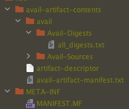

Avail Artifact
--------------------------------------------------------------------------------

This is a standalone upstream library that supports Avail project definition and
Avail artifact creation for the Avail [Programming Language](https://github.com/AvailLang/Avail).

# Artifact
The Avail Artifact is a versioned package of an Avail library or application.

## Avail Artifact Types
At the time of writing this there are two types of Avail Artifacts:
 1. `LIBRARY` - Contains only Avail Roots that can be shared as libraries in 
 2. `APPLICATION` - Contains all the components needed to run an Avail application.

## Artifact Structure

#### 1. avail-artifact-manifest.txt
The [Avail Artifact Manifest](src/main/kotlin/org/availlang/artifact/manifest/AvailArtifactManifest.kt) 
file describes the contents of an Avail artifact. It also contains project 
information that is used when the library is imported into another project. 
This file is a JSON file but is intentionally provided with `.txt` extension.

### 2. Avail-Sources
Contains all the Avail source files packaged in the artifact.

### 3. artifact-descriptor
The [artifact descriptor](src/main/kotlin/org/availlang/artifact/ArtifactDescriptor.kt)
contains a compact binary format that describes the artifact with:
1. The package type
2. Packaging version
3. Version of the artifact manifest file.

### 4. all_digests.txt
The digest listing all the source files inclued.

# Project
An Avail project is described as an [AvailProject](src/main/kotlin/org/availlang/artifact/environment/project/AvailProject.kt).
This is represented as a series of files found in the `.avail` directory of an
Avail project. These files are described in [Core Avail](https://github.com/AvailLang/Avail).
