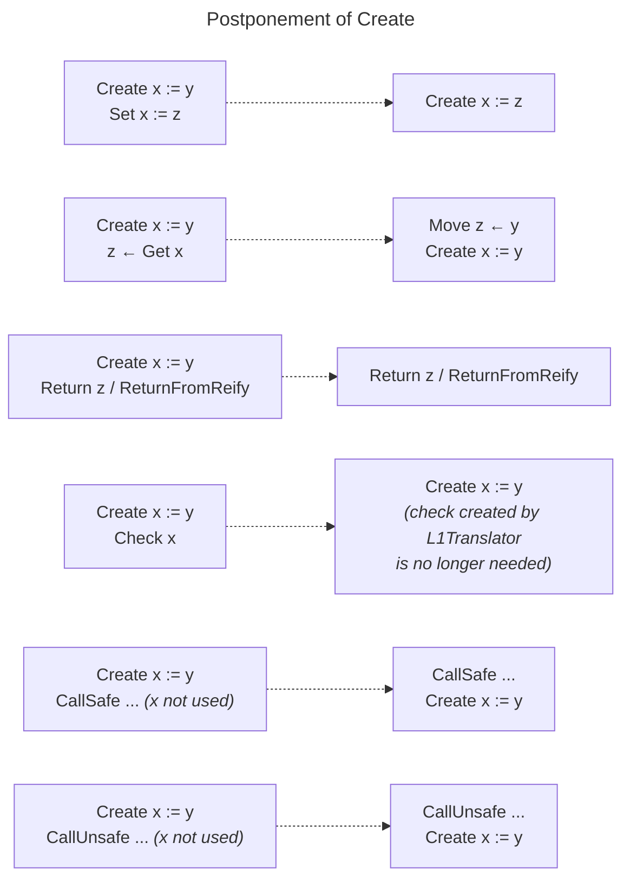
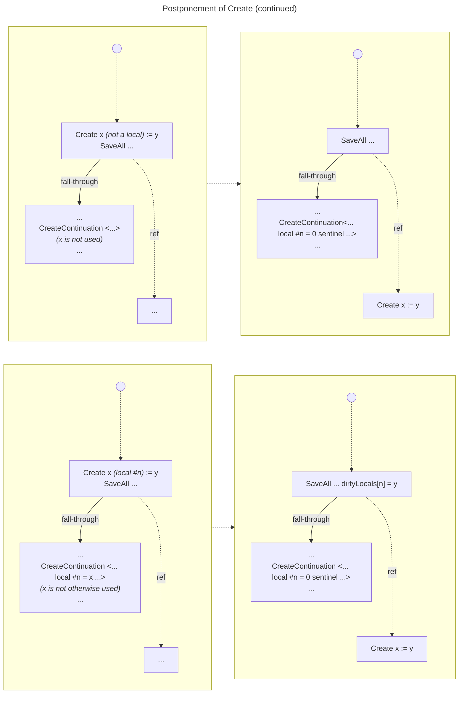
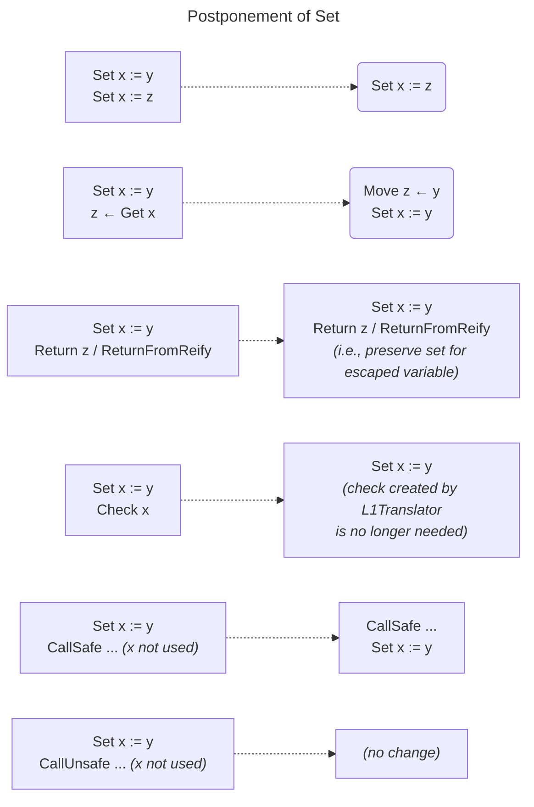
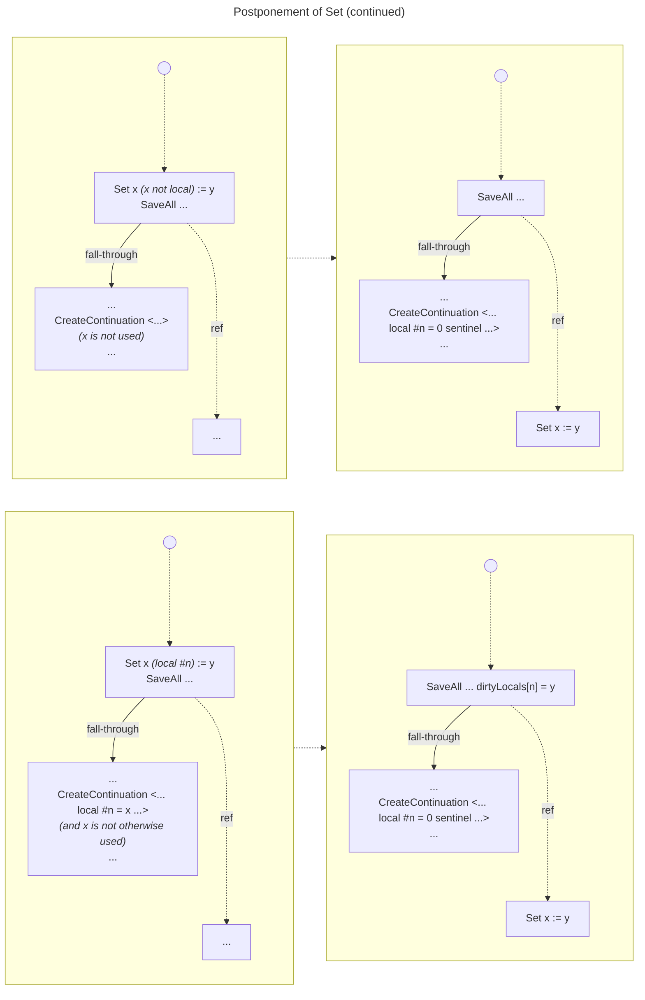
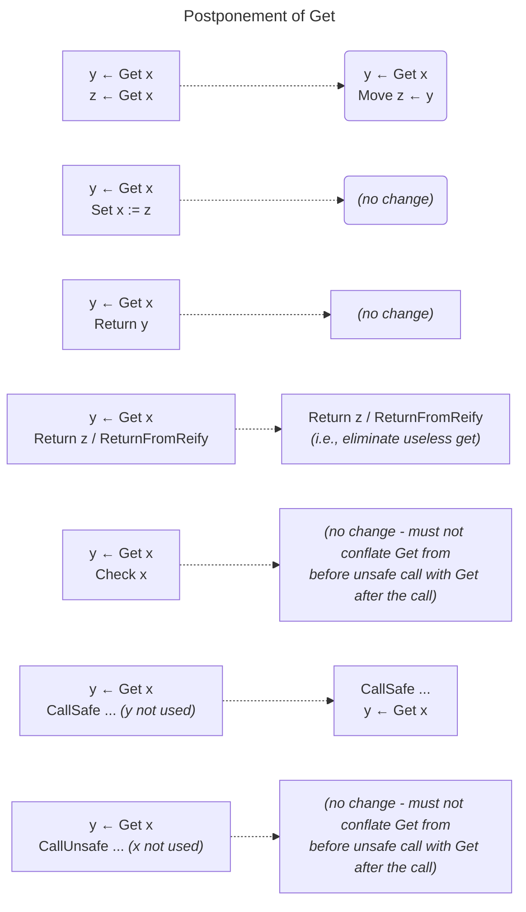
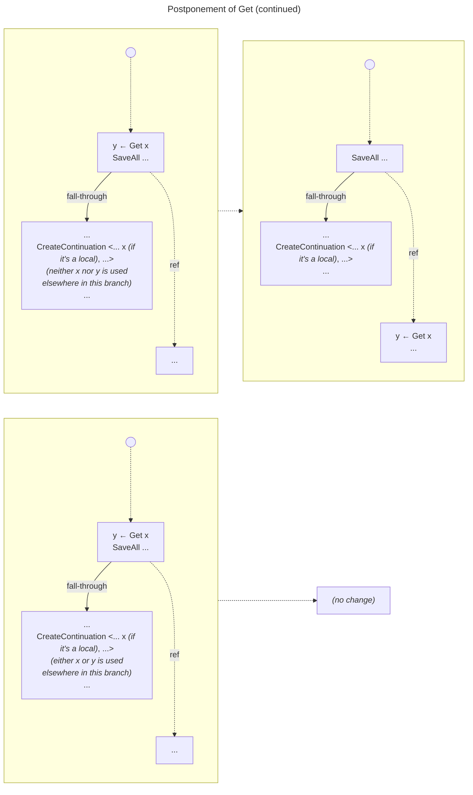

# Variable Elision

Continuations can have the constant `0` as a sentinel in variable slots to indicate they haven't been populated yet.  L2 registers that would hold those same slots can contain `0` to indicate the same condition.  When reifying a continuation from registers, those nils can usually be conserved.  However, the moment a continuation *becomes immutable or shared*,
1. those variables have to be created and written to the slots, and
2. the continuation has to be downgraded to another path to handle potentially escaped variables.

Simply switching the continuation's chunk to the default L1 executor is probably fine for this, to avoid generating extra code for this presumably cold occurrence.

If a continuation hasn't been constructed yet, or it has but it was still mutable upon resumption, restore the registers and continue with the assumption of non-escape for all variables that were previously non-escaped.  This situation does not create any new variables.

If a continuation has been created and then becomes immutable, variables are immediately created for it, and its resumption chunk falls back to L1, which is the same as it would be if a method it depends on changed membership.  Thus, L1 execution only ever sees actual variables.

If a variable is captured, say to be an outer of a function or an argument to some (non-inlined) function, the variable has to be created, and it's considered "escaped but not shared" at that moment.  When the function returns, all created local variables (not just any created for a particular call) have to be checked, or at least any that are still reachable by this chunk.  If they have become shared, then writes to them may have to trigger write traps, which occupies a considerable portion of the current control flow graphs, and also inhibits some optimizations.  So if any reachable local variables are now shared, we should construct the rest of the variables and fall back to L1.

Another case is that the called function triggers reification.  When we get our turn to reify the current frame, we can likewise check for any shared variables, and in that event create an L1 frame instead, creating any remaining variables.

Even when some non-shared but possibly immutable local variables have been created in the current frame registers, L2 can still track the most recent values that would have been written to those variables, postponing writes that won't be observed (because write traps are not possible).

## Transitions

### Interrupt at start of method
Use `0` in local variable slots, and on resumption know that those slots are still `0`, or it would have been marked immutable and returned into L1.

### Continuation --> immutable/shared
Fill in any missing variables and switch its chunk for the L1 chunk.

### Reification in call
Capture the current mix of `0` sentinels and variables in the new continuation.  Upon return, know that the same mix is present, and none of the present variables were observed, or it would have been marked immutable and returned into L1.

### Capturing or passing local variable for function call
Always create the variable.  After the call (direct return or resuming a reified continuation), check if *any* of the existing local variables have become shared, transitioning to L1 if any were.

### Read/write local variable
Leverage the fact that the variable is definitely not shared, so it cannot cause any read traps or write traps.

### Passing local variable to an inlined primitive invocation
Some primitives can make their arguments (or components of their arguments) shared.  If the primitive might do this, an explicit check for shared variables should be performed after the call, falling back to L1 if any are detected.  Returning a local variable doesn't have to do these checks, since that can't cause it to be shared.  It's still up to the caller to check if any of its variables has become shared.

### Primitive variable readers/writers
Some primitives exist just to get/set/clear/atomically-update a variable that was provided from elsewhere.  None of those primitives, to my knowledge, change the mutability of the passed variables.  Hm, in theory one could have a variable V, immutable, in an immutable tuple like `<V>`.  If an inlined primitive causes that tuple to be written into a shared variable SV, the tuple would become shared, as would V.  So V would have escaped.  I can't think of a corresponding example that does a read.  Maybe the variable-write primitives just shouldn't be inlined, allowing the normal generated post-return code of a call to just check all the locals for sharedness (and falling back to L1).

# Reworked form (proposed ~Oct 12, 2024)
The L1Translator produces a naive translation, with a sequence of L2_CREATE_VARIABLE instructions at the start, just like it did before the variable elision mechanism was introduced.  For every L1 instruction that does a get or set to something other than a literal (which is always marked as shared because it's referenced from code), the L1Translation produces an L2_VIRTUAL_GET_VARIABLE or L2_VIRTUAL_SET_VARIABLE.

 During postponement, we look for transformations that help us avoid some
 variable operations.  Here's a table of some instructions that appear in the postponement rules:

| Instruction                     | Description                                                                                                                                                                                                                                                                     |
|---------------------------------|---------------------------------------------------------------------------------------------------------------------------------------------------------------------------------------------------------------------------------------------------------------------------------|
| <nobr>Create x := y</nobr>      | Create a local in register x and initialize it to y.                                                                                                                                                                                                                            |
| <nobr>Set x := y</nobr>         | Set variable x to y.                                                                                                                                                                                                                                                            |
| <nobr>y ← Get x</nobr>          | Read variable x into register y.                                                                                                                                                                                                                                                |
| <nobr>Check x</nobr>            | Ensure variable x still has no reactors/shared, otherwise fall out to L1.  The virtual form of this just assumes it will be successful.                                                                                                                                         |
| <nobr>CallUnsafe</nobr>         | Invoke a function that might make an already escaped variable become shared or have a reactor.                                                                                                                                                                                  |
| <nobr>CallSafe</nobr>           | Invoke a primitive that can't make an escaped variable become shared or have a reactor.                                                                                                                                                                                         |
| <nobr>SaveAll</nobr>            | Save all live registers into an [A_RegisterDump], which is made available to a subsequent [L2_CREATE_CONTINUATION].  It also records which local variables are elided, and anything needed for the continuation to be able to construct them if it becomes immutable or shared. |
| <nobr>CreateContinuation</nobr> | Create a continuation, using mostly the information captured in an [A_RegisterDump] by a previous SaveAll.                                                                                                                                                                      |
| <nobr>ReturnFromReify</nobr>    | Reification of this frame has completed                                                                                                                                                                                                                                         |
| <nobr>Return</nobr>             | Return from this function.                                                                                                                                                                                                                                                      |

There's still an unresolved minor issue with these postponements.  Say we have `y ← Get x` at some point, then a bunch of other code that can't cause the variable to be altered or shared or a reactor added, then we have `z ← Get x`.  The postponements above aren't strong enough to covert the second Get into a `Move y → z`.  The addition of another pass after postponement can look for this exact situation.  The postponement rules will have already performed every possible variable elision, so this will only eliminate redundant Gets.
