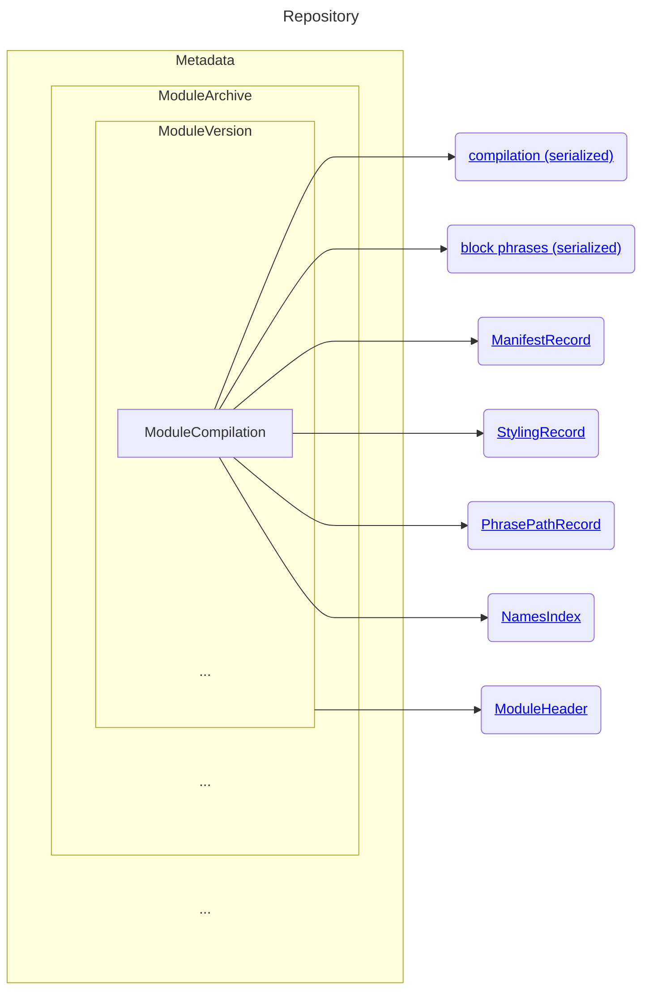

# Repository Structure

A [Repository](../../src/main/kotlin/avail/persistence/cache/Repository.kt),
like any file using the IndexedFile mechanism exported by the
`availlang:avail-storage` package, contains a metadata record, which is a byte
array.  Its format is described by [Metadata](#metadata) below.

## Metadata:

1. #modules
2. For each module,
   1. [moduleArchive](#modulearchive)

### ModuleArchive:
1. UTF8 rootRelativeName
2. digestCache size
3. For each cached digest,
   1. timestamp (long)
   2. digest (32 bytes)
4. #versions
5. For each version,
   1. [ModuleVersionKey](#moduleversionkey)
   2. [ModuleVersion](#moduleversion)

### ModuleVersionKey:
1. isPackage (byte)
2. digest (32 bytes)

### ModuleVersion:
1. moduleSize (long)
2. localImportNames size (int)
3. For each import name,
   1. UTF8 import name
4. entryPoints size (int)
5. For each entry point,
   1. UTF8 entry point name
6. compilations size (int)
7. For each compilation,
   1. [ModuleCompilationKey](#modulecompilationkey)
   2. [ModuleCompilation](#modulecompilation)
8. moduleHeaderRecordNumber (long)
9. stacksRecordNumber (long) (obsolete)

### ModuleCompilationKey:
1. #predecessorCompilationTimes (int)
2. For each predecessor compilation time,
   1. predecessor compilation time (long)

### ModuleCompilation:
1. compilationTime (long)
2. [recordNumber](#compilation-record) (long)
3. [recordNumberOfBlockPhrases](#block-phrases) (long)
4. [recordNumberOfManifestEntries](#manifestrecord) (long)
5. [recordNumberOfStyling](#stylingrecord) (long)
6. [recordNumberOfPhrasePaths](#phrasepathrecord) (long)
7. [recordNumberOfNamesIndex](#namesindex) (long)

-----------------------------------------------------------

## Module header record
A record containing serialized data from which a
[ModuleHeader](../../src/main/kotlin/avail/compiler/ModuleHeader.kt) can be
reconstructed.  Note that unlike some of the other records described herein,
this record is created for a module's header irrespective of the presence or
state of any other modules, so it's associated with a
[ModuleVersion](#moduleversion), not one of its
[ModuleCompilations](#modulecompilation).

If the header fails to parse for any reason, a -1 sentinel is silently used in
the header record number in the ModuleVersion.

No provision is made for hashing or comparing just the header characters of the
module source, so any change to the module file can cause a recompilation of the
header, even if the resulting record ends up being identical to another parsing
of the header.

The information in the record is a serialized sequence of objects as described
below.  No atoms or module objects are serialized, only basic things like
strings, tuples, sets, maps, and booleans.

1. the unqualified name of the module,
2. the tuple of zero or more module version strings listed after the optional
   "Versions" keyword in the header.
3. a tuple of import 7-tuples,
   1. the unqualified (verbatim) imported module name,
   2. the set of requested versions being imported,
   3. a boolean indicating Extends (true) versus Uses (false),
   4. the set of name strings being imported, only applicable if the wildcard
      flag below is false.
   5. a map of renames from new names to old names,
   6. the set of names to exclude, only applicable if the wildcard flag below
      is true,
   7. a "wildcard" boolean indicating whether to include everything but the
      explicitly excluded names (#6), or nothing but the included ones (#4).
4. the tuple of names exported by this module,
5. the tuple of entry point strings declared by this module,
6. the pragma strings occurring in this module,
7. the source position immediately after the "Body" keyword,
8. the line number of the "Body" keyword.

## Compilation record
A serialization of the sequence of top-level functions.  The deserializer
produces a series of zero-argument functions, each of which should be executed
before continuing the deserialization.

When running a top-level statement as part of module compilation, the
fast-loading mechanism detects and collects replayable side-effects, such as
defining methods, macros, lexers, restrictions, and anything else that should be
treated as an effect of loading the module.  If certain conditions are met, a
simpler, faster substitute top-level function is output in place of the one
actually executed during compilation.  When executing the top level functions
during compilation, the system not only collects any of these side-effecting
primitives, but it also detects execution of any unreplayable action, such as
reading from a module variable, or a module constant that was assigned a value
via a computation that was itself unreplayable.  Encountering such a situation
disables the fast-loading optimization for that one statement, which means the
original top-level function is serialized, rather than the optimized one that
only executes the collected effects.  Nearly all top-level functions in the
standard library can be optimized in this way, which is one reason why the
fast-loader is so much faster than the compiler.

Additionally, most side-effecting primitive invocations can be batched together
into larger functions (installing this method, installing that macro, adding
another method, etc), reducing the number of launched fibers during replay of
the fast-loader functions.  You may see such composite functions when using the
Avail debugger during module loading.

-----------------------------------------------------------

## Block phrases

*Note that this record is different from the
[recordNumberOfPhrasePaths](#phrasepathrecord), which contains distilled
information used by styling and navigation even when the module is not currently
loaded.*

A raw function is able to answer the phrase that it was constructed from, if it
was produced by the compiler rather than synthesized some other way.  However,
these phrases can be both bulky and time-consuming to deserialize, while also
rarely being actually needed at runtime.

When the top-level functions are being serialized into the [compilation
record](#compilation-record) by the fast-loader mechanism, the field in each raw
function that holds the generating phrase is stripped out, allowing the fast
loader to avoid deserializing these usually unnecessary phrases.  However, all
of these phrases are simultaneously collected into a tuple of block phrases for
that module.  When the phrase is removed from a raw function, it is replaced by
the index of that block phrase within that tuple of phrases. After the module's
compilation record has been written to the repository, the tuple of phrases is
output to a separate block phrases record.

At some later time, perhaps in another session after fast-loading the module,
the phrase of a raw function may be requested.  If an integer is found in that
field, the record containing the tuple of block phrases for that module is
deserialized and cached for that module, and the integer is used to index that
tuple, storing the phrase in the slot that the integer had occupied.  The block
phrase can then be returned to the requester.

In theory we could have written each phrase into its own repository record, but
the phrases of nested blocks already must refer to each other (outer to inner),
and the constants and types that appear in the phrases in a module have a great
deal of overlap.  So fetching the entire tuple of phrases for a module tends to
be more efficient, and ensures preservation of mutual identity.

Because the phrases in a module can refer to values created within that module,
we "prime" the serializer used to encode the block phrase tuple.  In particular,
during serialization of the block phrase tuple, the serializer can see (at
"negative indices", see `Serializer.lookupPumpedObject` and
`Deserializer.lookupPumpedObject`) all objects that were output in the
compilation record, avoiding the need to output them again in the serialized
block phrase tuple.  In fact, they *must not* be serialized again with the block
phrase tuple, as some of those objects must have an identity mutually consistent
between the raw functions and the block phrases.

At fast-loading time, all deserialized objects are preserved in order in a list,
in case the block phrase tuple needs to be deserialized, at which time the new
deserializer is primed with that list of objects.

-----------------------------------------------------------

## ManifestRecord

This record contains information about methods, macros, lexers, restrictions,
and similar features added by the module, including line numbers on which those
features occur.

1. For each entry, terminated by the end of the record,
   1. A [ModuleManifestEntry](../../src/main/kotlin/avail/compiler/ModuleManifestEntry.kt), comprising
      1. ordinal (byte) of [SideEffectKind](../../src/main/kotlin/avail/compiler/SideEffectKind.kt)
      2. Either null if byte = 0, or if byte = 1,
         1. NameInModule(module name UTF-8, atom name UTF-8)
      3. UTF-8 summary text to present in the [StructureView](
         ../../src/main/kotlin/avail/anvil/views/StructureView.kt)
      4. If the entry has no type information then 0, otherwise the number of arguments + 1 and:
         1. A UTF-8 string describing each type, and
         2. A UTF-8 string describing the return type.
      5. The line number of the start of the top-level statement that added this
         entry,
      6. The line number of the start of the definition, such as the body of a
         method.
      7. an index into the total sequence of phrase nodes (not just the list of
         top-level phrases) in this module's [PhrasePathRecord](#block-phrases),
         which identifies the phrase node responsible for the definition. This
         is useful for highlighting the entire definition.
      

-----------------------------------------------------------

## StylingRecord
This is a distillation of styling information that can be applied to a module's
source in an editor, even when the module is not loaded.  The styling
information was specified during compilation by
[P_StyleToken](../../src/main/kotlin/avail/interpreter/primitive/style/P_StyleToken.kt)
or a related primitive, by running the styling function associated with a sent
method or macro, or by the lexer that produced a token.

In order to ensure even the earliest bootstrapped code has some styling applied,
a [Primitive](../../src/main/kotlin/avail/interpreter/Primitive.kt) can override
the `bootstrapStyler()` method to return some other suitable primitive to style
its invocations as a method, macro, or lexer.  For example, the string lexer,
[P_BootstrapLexerStringBody](../../src/main/kotlin/avail/interpreter/primitive/bootstrap/lexing/P_BootstrapLexerStringBody.kt),
indicates its literals should be styled with
[P_BootstrapLexerStringBodyStyler.kt](../../src/main/kotlin/avail/interpreter/primitive/style/P_BootstrapLexerStringBodyStyler.kt).

The record also contains navigation information about local declarations (like
constants and variables).

Because Avail supports Unicode but Java/Kotlin only support UTF-16 Chars, we
record all positions in the source in terms of UTF-16 code points, where
surrogate pairs occupy two distinct indices.

See [StylingRecord.kt](../../src/main/kotlin/avail/persistence/cache/record/StylingRecord.kt)

1. #styleNames
2. For each styleName,
   1. UTF8 styleName
3. #spans
4. For each span,
   1. styleNumber (compressed int, 0=no style)
   2. length (compressed int), measured in UTF-16 codepoints.
5. #declarations
6. For each local declaration,
   1. delta (compressed, in UTF-16 codepoints) from end of previous declaration
   2. length (compressed, in UTF-16 codepoints)
   3. Optional 0 for special treatment (note: #usages cannot be zero)
   4. #usages, compressed
   5. For each usage,

      If normal,
      1. delta from end of previous declaration or usage (compressed, UTF-16).
         Size is assumed to be same as declaration in this case.

      If special treatment,
      1. position of start of usage in UTF-16 codepoints.
         Absolute for first usage of a declaration, otherwise relative to
         previous usage's end.
      2. size of usage token in UTF-16 codepoints.
7. #unusedDeclarations
8. For each unused declaration,
   1. Start of declaration token in UTF-16 codepoints.
   2. Size in UTF-16 codepoints

-----------------------------------------------------------

## PhrasePathRecord

This record contains distilled information about all token locations and the
atom usages within the module, in such a way that the module does not have to be
loaded to make use of it.

See [PhrasePathRecord.kt](../../src/main/kotlin/avail/persistence/cache/record/PhrasePathRecord.kt)

1. #moduleNames
2. For each module name,
   1. UTF-8 module name
3. #atomNames
4. For each atom name,
   1. UTF-8 atom name
5. #root phrases
6. For *each* phrase node in left-right, top-down order,
   1. phrase node:
      1. index of module name, or 0 if none
      2. index of atom name, or 0 if none
      3. [UsageType](../../src/main/kotlin/avail/persistence/cache/record/NamesIndex.kt) ordinal
      4. #of [PhraseNodeTokens](../../src/main/kotlin/avail/persistence/cache/record/PhrasePathRecord.kt)
      5. For each token span,
         1. token start relative to cursor
         2. token size (adjusting cursor to pastEnd)
         3. line number
         4. token index in name (e.g., the `"+"` of `"_+_"` is 2)
            1. if token index in name = 0, the UTF-8 token content string
   2. #children

-----------------------------------------------------------

## NamesIndex

This record contains information about the atoms that are declared, have
definitions added, or are invoked as methods, macros, or lexers inside the
module.  The record is a
[NamesIndex](../../src/main/kotlin/avail/persistence/cache/record/NamesIndex.kt).

There is a mechanism for reducing the scope of searches using a Bloom filter,
but that is not yet (2023.10.10) active.  The intention is to construct the
filter for all (or some) packages, so that a search from the top of a module
root could eliminate large branches quickly when searching for a name that
doesn't happen to be used in that package.  For now, the standard library can be
searched for the first time in at most a couple of seconds, and subsequent
searches are imperceptibly fast.

1. #modules with mentioned names,
2. Each module name as a UTF-8 string,
3. #mentioned atom name, or alias of a name,
4. Each atom name or local alias as a UTF-8 string,
5. #NameOccurrences,
6. For each `NameOccurrences` object,
   1. #declarations,
   2. For each declaration of the name,
      1. A boolean indicating this is an alias declaration
      2. If it's an alias,
         1. the index of the original atom's module name,
         2. the index of the original atom's name,
      3. The index of the phrase in the [PhrasePathRecord](#phrasepathrecord)
         (not just of the top-level phrases) which was a declaration of the name
         or alias,
   3. #definitions of the name,
   4. For each definition of the name,
      1. The ordinal of the `DefinitionType` identifying the kind of definition
         that this definition is (method, macro, etc),
      2. An index into the module's [ManifestRecord](#manifestrecord) that also
         identifies the definition.
   5. #usages of the name,
   6. For each usage of the name,
      1. The ordinal of the usage's `UsageType` (method send, macro send, etc.),
      2. The index of the phrase in the [PhrasePathRecord](#phrasepathrecord)
         (not just of the top-level phrases) which was a usage of the name.
